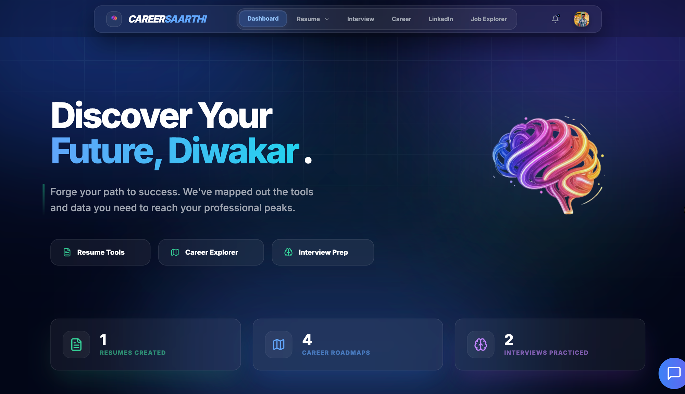

<div align="center">

<br />

# 🚀 CareerSaarthi — *Decode Your Future.*

### An AI-powered career acceleration platform for high-ambition students

[](https://careersaarthi.vercel.app)

<br />

[](https://react.dev)
[](https://vitejs.dev)
[](https://nodejs.org)
[](https://supabase.com)
[](https://threejs.org)
[](https://www.framer.com/motion)

<br />

> *"The gap between who you are and who you want to be is called **Saarthi**."*

</div>

---

## 📖 What is CareerSaarthi?

**CareerSaarthi** (formerly NexaGen AI / CareerForge) is a full-stack, AI-powered career mentorship ecosystem built for students navigating the competitive tech industry. It consolidates every tool a job-seeker needs — resume building, AI analysis, mock interviews, LinkedIn optimization, and job discovery — into one beautifully crafted platform.

The platform features a **cinematic 3D landing experience** built with Three.js and React Three Fiber, smooth GPU-accelerated animations via GSAP + Framer Motion, and a robust Node.js/Supabase backend powering real AI integrations through OpenRouter and Gemini LLMs.

<div align="center">
<br />

<br />
<sub><em>The personal dashboard — activity stats, resume/roadmap/interview counters, and quick access to every tool.</em></sub>
<br /><br />
</div>

---

## ✨ Core Features

### 📄 ATS Resume Builder
Build job-winning resumes with precision-crafted templates. The editor supports live preview, multiple professionally designed layouts, and exports to PDF — all ATS-optimized out of the box.

### 🔍 AI Resume Analyzer
Upload any resume PDF and receive instant, structured AI feedback: ATS compatibility scores, keyword gap analysis, impact rating, and actionable improvement suggestions powered by large language models.

### 🎤 AI Mock Interview Simulator
Realistic, role-specific interview sessions driven by LLMs. Questions are generated contextually, answers are scored against clarity, STAR-structure, and keyword-density rubrics, and every session is stored with full performance analytics and history.

### 💼 LinkedIn Optimizer
AI-driven analysis of your LinkedIn profile to identify gaps, suggest headline improvements, and provide data-driven strategies to attract recruiters — directly from a PDF export of your profile.

### 🗺️ Career Explorer & Job Finder
Discover curated career roadmaps with skill trees, learning paths, and salary benchmarks for roles across the industry. The integrated Job Explorer surfaces real job listings (via the Adzuna API) with detailed descriptions and match scores.

### 📊 Personal Dashboard
A unified command center showing activity history, interview performance trends, resume versions, and a personalized AI assistant for quick queries — all sharing the same profile context across features.

---

## 🧠 Engineering Highlights

A few things worth calling out beyond the feature list:

- **No API keys ever ship to the browser.** Every LLM call — OpenRouter and Gemini alike — is proxied through the Express backend (`/api/ai/generate`, `/api/ai/gemini`). Client-side calls were audited and moved server-side so secrets never touch the bundle.
- **Model fallback chains with backoff.** `/api/ai/generate` walks a prioritized list of free OpenRouter models with exponential backoff on rate limits, and falls back to a cheap paid model (`gpt-4o-mini`) only when every free option is exhausted — keeping the app usable without sacrificing cost efficiency.
- **Gemini key-pool rotation.** `/api/ai/gemini` pools multiple `GEMINI_API_KEY_*` values, picks one at random per request, and retries with backoff on 429s, spreading load across quota instead of hard-failing.
- **Structured interview scoring.** Mock interview answers are graded against a defined rubric (clarity, STAR structure, keyword density) rather than a single opaque LLM score, so feedback is consistent and explainable.
- **Shared profile context.** Resume, interview, and LinkedIn features all read from the same profile state, so AI feedback stays consistent across tools instead of each feature reasoning from scratch.
- **Graceful degradation.** The job search endpoint falls back to a curated mock listing set if the Adzuna API keys aren't configured, so the app never breaks in a partial-config environment.

---

## 🛠️ Tech Stack

### Frontend
| Technology | Purpose |
|---|---|
| **React 18** + **Vite 7** | Core UI framework with fast HMR |
| **Tailwind CSS** | Utility-first styling |
| **Framer Motion** | Page transitions & micro-animations |
| **GSAP + Lenis** | Smooth scroll & GPU-accelerated effects |
| **Three.js + React Three Fiber** | Cinematic 3D hero background |
| **Recharts** | Analytics & performance charts |
| **React Router v6** | Client-side routing |
| **Lucide React** | Consistent icon system |

### Backend
| Technology | Purpose |
|---|---|
| **Node.js + Express** | REST API server |
| **Supabase (PostgreSQL)** | Database & storage |
| **JWT + Google OAuth** | Secure authentication |
| **Cloudinary** | Image & asset hosting |
| **Multer + pdf-parse** | Resume/LinkedIn PDF upload & text extraction |
| **OpenRouter + Gemini** | LLM integration for AI features (server-side proxy only) |
| **bcryptjs** | Password hashing |

---

## 🏗️ Project Architecture

```
CareerSaarthi/
├── src/
│   ├── components/
│   │   ├── 3d/              # Three.js scene & WebGL components
│   │   ├── Interview/       # Interview UI components
│   │   ├── JobFinder/       # Job search components
│   │   ├── LinkedIn/        # LinkedIn optimizer components
│   │   ├── Resume/          # Resume builder & templates
│   │   ├── UI/              # Shared UI primitives
│   │   └── layout/          # Navbar, SmoothScroll, wrappers
│   ├── pages/               # Route-level page components
│   │   ├── LandingPage.jsx
│   │   ├── Dashboard.jsx
│   │   ├── ResumeBuilder.jsx / ResumeAnalyzer.jsx / ResumePreview.jsx
│   │   ├── InterviewPrep.jsx / MockInterview.jsx / InterviewHistory.jsx
│   │   ├── LinkedInOptimizer.jsx
│   │   ├── JobExplorer.jsx / JobDetails.jsx
│   │   ├── CareerExplorer.jsx / CareerCompass.jsx / Strategies.jsx
│   │   ├── AIAssistant.jsx
│   │   └── Profile.jsx / SignIn.jsx
│   ├── services/ai/         # OpenRouter/Gemini client wrappers, interview & speech services
│   ├── api/                 # Axios API client layer
│   └── utils/                # Helpers & shared utilities
│
└── server/
    ├── routes/
    │   ├── auth.js          # Register/login, Google OAuth, JWT session
    │   ├── ai.js             # OpenRouter + Gemini proxy (fallback chains, key rotation)
    │   ├── resumes.js       # Resume CRUD + AI analysis (PDF upload)
    │   ├── interviews.js    # Interview sessions, scoring, history & analytics
    │   ├── profiles.js       # User profiles + LinkedIn PDF analysis
    │   ├── jobs.js           # Job search (Adzuna) + saved jobs
    │   ├── roadmaps.js      # Career roadmaps
    │   └── upload.js         # Profile picture upload (Cloudinary)
    ├── models/              # Data models (User, Resume, InterviewSession, etc.)
    ├── lib/                 # Supabase client & helpers
    └── index.js             # Express server entry point
```

---

## 🔌 API Overview

All routes are mounted under `/api` and, aside from `auth`, expect an authenticated Supabase user.

| Route | Responsibility |
|---|---|
| `POST /api/auth/register`, `/login`, `/google`, `GET /me` | Email/password + Google OAuth authentication, JWT session |
| `POST /api/ai/generate` | Server-side LLM proxy with model fallback chain for chat/interview/generic completions |
| `POST /api/ai/gemini` | Server-side Gemini proxy with rotating key pool and 429 backoff |
| `GET/POST /api/resumes`, `POST /api/resumes/analyze` | Resume CRUD + AI-powered ATS analysis from an uploaded PDF |
| `GET/POST/PUT /api/interviews`, `GET /stats/patterns`, `POST /cheat-report` | Interview session lifecycle, scoring, history & pattern analytics |
| `GET/POST /api/profiles`, `POST /analyze-linkedin` | Profile CRUD + AI LinkedIn PDF analysis |
| `GET /api/jobs/search`, `GET/POST/DELETE /saved` | Live job search (Adzuna) with mock fallback, saved-jobs management |
| `GET/POST /api/roadmaps` | Curated career roadmap data |
| `POST /api/upload/profile-picture` | Cloudinary-backed avatar upload |

---

## 🚀 Getting Started

### Prerequisites
- Node.js ≥ 18
- A [Supabase](https://supabase.com) project
- An [OpenRouter](https://openrouter.ai) API key (and optionally a [Gemini](https://ai.google.dev) key)
- A [Cloudinary](https://cloudinary.com) account

### 1. Clone the Repository

```bash
git clone https://github.com/DiwakarMishra-CODER/CareerSaarthi.git
cd CareerSaarthi
```

### 2. Configure Environment Variables

**Frontend** — create `.env` in the root (see `.env.example`). Only publishable, non-secret values belong here — Vite compiles them straight into the client bundle:
```env
VITE_SUPABASE_URL=your_supabase_url
VITE_SUPABASE_ANON_KEY=your_supabase_anon_key
VITE_API_BASE_URL=http://localhost:4000
VITE_GOOGLE_CLIENT_ID=your_google_client_id
```

**Backend** — create `server/.env` (see `server/.env.example`). All AI provider keys live here only, never on the client:
```env
PORT=4000
SUPABASE_URL=your_supabase_url
SUPABASE_SERVICE_ROLE_KEY=your_supabase_service_role_key
OPENROUTER_API_KEY=your_openrouter_api_key
GEMINI_API_KEY_1=your_gemini_api_key
GOOGLE_CLIENT_ID=your_google_client_id
ADZUNA_APP_ID=your_adzuna_app_id
ADZUNA_APP_KEY=your_adzuna_app_key
```

### 3. Install & Run

```bash
# Install frontend dependencies
npm install

# Install backend dependencies
cd server && npm install && cd ..

# Start the backend (port 4000)
cd server && npm run dev

# In a new terminal — start the frontend (port 5173)
npm run dev
```

Open [http://localhost:5173](http://localhost:5173) and you're live. 🎉

---

## 🌐 Deployment

The frontend is deployed on **Vercel/Netlify** (both `vercel.json` and `netlify.toml` are configured with SPA redirect rules). The backend deploys to any Node.js-compatible host (Railway, Render, Vercel Functions, etc.).

```toml
# netlify.toml (already configured)
[[redirects]]
  from = "/*"
  to = "/index.html"
  status = 200
```

---

## 🎨 Design Philosophy

CareerSaarthi is built with a **premium-first** design ethos:

- **Dark, cinematic aesthetic** — deep navy/slate backgrounds with electric blue-to-violet gradients
- **3D WebGL hero** — a live Three.js particle field creating depth and motion on landing
- **Glassmorphism UI** — frosted glass cards with `backdrop-blur` and translucent borders
- **Physics-based animations** — spring-driven Framer Motion transitions and magnetic buttons
- **Smooth scrolling** — Lenis inertia scroll for a native app-like feel

---

## 📬 Contact

Built by **Diwakar Mishra** — Full Stack Developer & UI/UX Enthusiast.

[](https://www.linkedin.com/in/diwakar-mishra-dev/)


### Contributors

**Kshitij Garg** — AI & Data Analytics Enthusiast
[](https://www.linkedin.com/in/kshitij-garg-047221344/)

**Rahul Kumar** — Software Developer
[](https://www.linkedin.com/in/rahulkumarmait/)

**Ishan Gupta** — Full Stack Developer
[](https://www.linkedin.com/in/ishan-gupta-08686631a/)

For queries, collaborations, or feedback — connect on LinkedIn.

---

<div align="center">

**© 2026 CareerSaarthi. All rights reserved.**

*Built for ambitious students. Powered by AI.*

</div>
